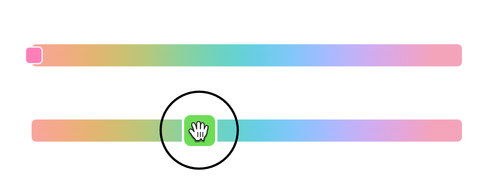

# Simple Hue Picker



A tiny library to show a Hue picker for user!

- **Small**. 1.19 Kb (minified and gzipped). No deps. Controlled by [Size Limit](https://github.com/ai/size-limit).
- **Framework agnostic**. Works with TypeScript and any framework: React, Vue, Preact, Solid and Svelte!

<a href="https://evilmartians.com/?utm_source=simple-hue-picker">
  
</a>

## Install

```
npm install simple-hue-picker
```

# Usage

Since it's a Web Component and not a framework component, it requires some framework-specific treatment. But don't fret, no hacks.

The first common step is to import the module. Do this in your `main.ts` file or in your wrapper (if you need one):

```ts
import 'simple-hue-picker';
```

As soon as you do this, you'll have a new globally-available component called `<hue-picker />`. Under the hood the whole component is just an `<input type="range" />` and an SVG that gives you the background.

It accepts all the same props as a usual `<input />`. The selected value is stored in, as usual, `value`.

The lib exposes 2 events: `change` and `input`, both fire a `CustomEvent<string>`. Be aware of the difference between those two: `change` only fires when the value is *commited* (the mouse is released), while `input` is realtime. 

This is what a typical even handler would look like:

```tsx
<hue-picker onInput={(e) => setValue(e.detail)} />
```

## Usage with React

React is the least Web Components friendly, because of its Synthetic events. But have no fear: we ship a special React component for you, that does all the dirty work for you!

```tsx
import { HuePicker } from "simple-hue-picker/react";

function App() {
  const [selected, setSelected] = useState("120");

  return <HuePicker step={10} value={selected} onInput={newValue => setSelected(newValue)} />;
};
```

## Usage with Vue

Vue is Web Components friendly, so usage is pretty simple:

```vue
<script setup lang="ts">
import type { HueChangeEvent } from "simple-hue-picker/react";
import { ref } from 'vue'

const selectedHue = ref('120')
</script>

<template>
  <div>
    {{selectedHue}}
  </div>
  <hue-picker :value="selectedHue" @input="(e: HueChangeEvent) => selectedHue = e.detail">
  </hue-picker>  
</template>
```
  
## Usage with Preact

Preact is Web Components friendly, so usage is extremely simple:

```tsx
export function App() {
  const [selected, setSelected] = useState("150");
  return <hue-picker value={selected} onInput={e => setSelected(e.detail)}></hue-picker>
}
```

## Usage with Solid

Solid is Web Components friendly, so usage is simple, but you need to explicitly give the compiler a hint, that `value` is an attribute:

```tsx
function App() {
  const [selected, setSelected] = createSignal("120");

  return (
    <hue-picker
      step={10}
      // Notice the attr:
      attr:value={selected()}
      onInput={(e) => setSelected(e.detail)}
    ></hue-picker>
  );
}
```

## Usage with Svelte

Svelte is Web Components friendly, but as of my knowledge it doesn't provide any way for a library author to define types for Web Components. Therefore, it's a bit of a manual work and doesn't work with two-way data binding:

```html
<script lang="ts">
  import type { HueChangeEvent } from "simple-hue-picker";

  let value = "120";
  const onInput = (e: HueChangeEvent) => (value = e.detail);
</script>

<hue-picker {value} step="10" on:input={onChange} />
```

## Usage with SSR

This library is powered by Web Components. If you try to initialize it in Node environment, you'll get something like **"HTMLElement is not defined"**. Since this component doesn't provide any critical functionality, feel free to use tools that your meta-framework provide you with that allow you to bypass the SSR step for this component. For example, for **Next.js** it would be something like this:

```tsx
import dynamic from "next/dynamic";

const HuePicker = dynamic(() => import("simple-hue-picker/react"), {
  ssr: false,
});

function App() {
  const [selected, setSelected] = useState("120");

  return <HuePicker step={10} value={selected} onInput={newValue => setSelected(newValue)} />;
};
```

## Usage with forms

When you use an input inside a Web Component, it doesn't propagate its value in `FormData` when you submit a form. We solve this by rendering an `<input type="hidden" />` with the provided `name`, and sync its value with the hue-picker.

TLDR: all is covered, use `name` as usual 😁
